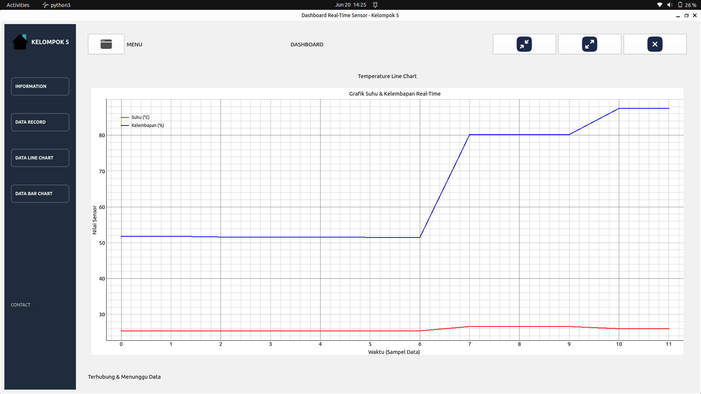
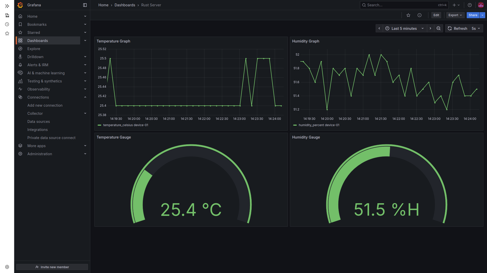
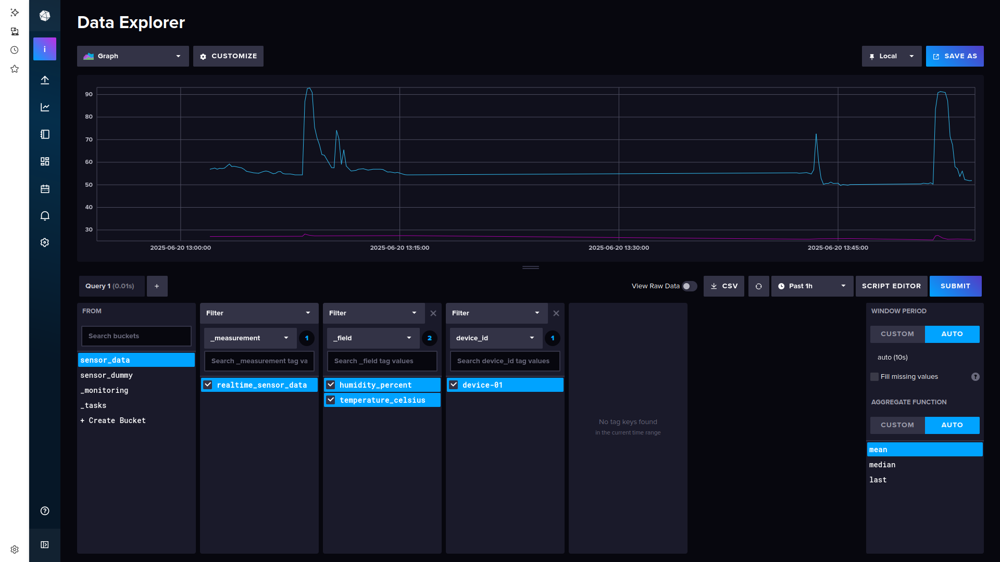
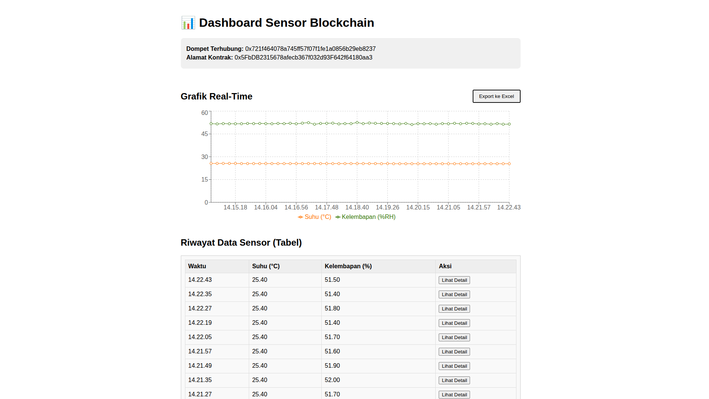

# 🌡️ RS485 Rust-Based Temperature & Humidity Monitoring

### With InfluxDB, Grafana, Qt GUI, and Ethereum Blockchain Smart Contract Integration

Sistem ini dirancang untuk memantau **suhu dan kelembaban lingkungan** di sektor industri seperti minyak dan gas, dan mencatatnya ke **blockchain Ethereum** demi menjamin **integritas, transparansi, dan traceability** data lingkungan secara real-time.

---

## 🎓 Proyek Kelompok 5

**Mata Kuliah:** Interkoneksi Sistem Instrumentasi  
**Departemen:** Teknik Instrumentasi  
**Fakultas:** Vokasi  
**Universitas:** Institut Teknologi Sepuluh Nopember (ITS)

### 👥 Anggota:

* Andik Putra Nazwana – 2042231010
* Akhmad Maulvin Nazir Zakaria – 2042231028
* Naufal Faqiih Ashshiddiq – 2042231068

**Dosen Pembimbing:** Ahmad Radhy, S.Si., M.Si

---

## ⚙️ Teknologi yang Digunakan

| Komponen          | Teknologi                             | Peran Utama                                                 |
| ----------------- | ------------------------------------- | ----------------------------------------------------------- |
| **Sensor**        | SHT20 via RS485 Modbus RTU      | Mengukur suhu dan kelembapan                                |
| **Gateway**       | Rust + `tokio`, `modbus`, `ethers-rs` | Membaca sensor, kirim data ke TCP, InfluxDB, dan Blockchain |
| **Visualisasi**   | Grafana, Qt (PySide6), InfluxDB       | Menampilkan grafik dan tabel data real-time                 |
| **Blockchain**    | Ethereum, Hardhat, Solidity, Sepolia  | Mencatat data sensor secara immutable & transparan          |
| **Frontend DApp** | React, Web3.js, ethers.js, MetaMask   | Menampilkan data Blockchain secara real-time berbasis Web3  |

---

## 🔄 Alur Kerja Sistem

### 1. ✨ **Sensor & Gateway**

* Sensor SHT20 membaca suhu dan kelembapan.
* Data dibaca melalui Modbus RTU oleh program Rust.
* Gateway Rust melakukan 3 hal sekaligus:

  * Mengirim data ke **InfluxDB** (disimpan time-series)
  * Mengirim data ke **Qt GUI** melalui **TCP Socket**
  * Mengirim data ke **Smart Contract** (Blockchain Ethereum)

### 2. 📈 **Dashboard & Visualisasi**

* **Qt GUI** (PySide6) menampilkan data TCP secara real-time:

  * Tabel
  * Grafik Line (Suhu dan Kelembapan)
  * Grafik Batang
* **Grafana** membaca dari **InfluxDB** untuk visualisasi berbasis web

### 3. 🔐 **Pencatatan Blockchain**

* Gateway Rust menggunakan `ethers-rs` untuk memanggil fungsi `recordData()` pada smart contract `DataRegistry`.
* Data dicatat di Ethereum sebagai transaksi:

  * Immutable
  * Traceable
  * Publicly verifiable
* Jika menggunakan Sepolia, transaksi dilakukan dengan wallet yang diatur via private key `.env`

### 4. 🚀 **Frontend DApp** (React + MetaMask)

* Pengguna membuka dashboard web
* MetaMask akan diminta untuk connect wallet
* DApp akan mendengarkan **event `DataRecorded`** dari smart contract
* Tabel & grafik di DApp akan diperbarui otomatis saat ada data baru

---

## 📄 Struktur Proyek

```bash
.
├── sensor-gateway/         # Program Rust: Modbus RTU → TCP + Blockchain
├── sensor-dashboard-qt/    # GUI Desktop Qt PySide6: Tabel + Grafik Real-Time
├── hardhat-sensor-contract # Smart Contract + Deployment + Test (Hardhat)
├── frontend-dapp/          # Web3 DApp React: Visualisasi data blockchain
└── README.md               # Dokumentasi proyek
```

---

## 🔒 Keunggulan Sistem

* ✅ **Realtime**: Pantauan langsung dari sensor ke dashboard
* ✅ **Transparan**: Data tercatat di blockchain dan bisa diverifikasi publik
* ✅ **Immutable**: Data tidak bisa diubah/dihapus setelah masuk ke Ethereum
* ✅ **Multi-Platform**: Mendukung visualisasi desktop (Qt) dan web (React + MetaMask)
* ✅ **Audit-Friendly**: Tiap data punya jejak transaksi

---

## 📖 Contoh Data yang Dicatat

| Timestamp           | Temperature (°C) | Humidity (%) |
| ------------------- | ---------------- | ------------ |
| 2025-06-20 08:43:00 | 27.45            | 68.20        |
| 2025-06-20 08:43:05 | 27.50            | 68.10        |

Data ini dikirim oleh Rust Gateway ke Smart Contract Ethereum dan juga disimpan di InfluxDB.

---

## 🧪 Catatan Teknis

* Hardhat digunakan untuk **menulis, mengetes, dan deploy smart contract** ke Sepolia/local node.
* `.env` menyimpan:

  * Alamat kontrak
  * Alamat wallet pengirim (gateway)
  * Private key (untuk Rust & Web3 signer)
* Semua pengiriman data ke blockchain dilakukan via fungsi:

```solidity
function recordData(string memory deviceId, int256 temp, int256 hum) public
```

---

## 📈 Visualisasi

Berikut adalah tampilan visualisasi dari berbagai sisi sistem:

### 🖥️ Qt GUI (Desktop Realtime Monitoring)
Menampilkan data suhu & kelembapan dengan grafik line dan batang.


### 📊 Grafana (Web Dashboard via InfluxDB)
Menampilkan data historis dengan time-series chart.


### 📂 InfluxDB Bucket View
Menampilkan struktur bucket dan preview data terbaru.


### 🌐 Web3 DApp (Frontend React + MetaMask)
Menampilkan data yang dicatat ke Blockchain Ethereum secara real-time.


---

## 🔧 Cara Jalanin

```bash
# 1. Jalankan server Rust (Gateway)
cargo run --release

# 2. Jalankan Qt GUI
python3 main.py

# 3. Jalankan Hardhat (Local atau Sepolia)
npx hardhat node
npx hardhat run scripts/deploy.js --network localhost

# 4. Jalankan React DApp
cd frontend-dapp
npm install && npm start
```

---

> ✨ Proyek ini bertujuan untuk menggabungkan sistem monitoring industri dengan transparansi dan keamanan teknologi blockchain.
